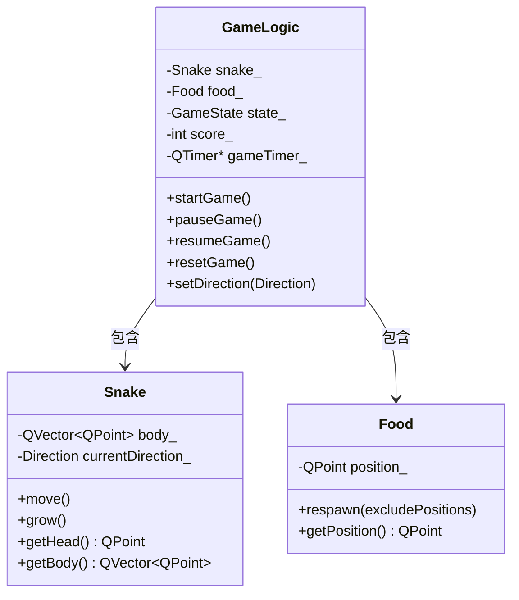
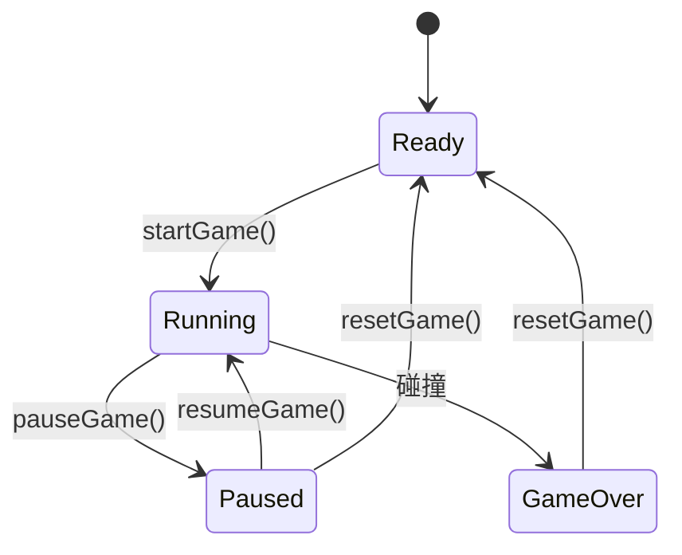

# Qt 贪吃蛇技术指南

## 1. 项目概述

本项目使用 **Qt** 框架和 **C++** 实现经典贪吃蛇游戏，作为构建模块化、事件驱动桌面应用的参考实现。

### 1.1 核心目标
- **分层架构**：严格分离逻辑层（Model）与界面层（View）。
- **事件驱动设计**：使用 Qt 信号槽机制实现解耦通信。
- **双模式渲染**：支持传统的 `QPainter` (Widget) 和现代的 `QGraphicsScene` (Scene) 两种实现。
- **高效实现**：基于 `QTimer` 的游戏循环。

<!-- TODO: 可扩展内容 - 添加性能基准测试或与 QGraphicsScene 实现的对比 -->

---

## 2. 架构与设计

### 2.1 架构模式
系统采用 **MVC（模型-视图-控制器）** 风格架构，确保组件解耦与可测试性。

| 组件                     | 类                                               | 职责                                           |
| :----------------------- | :----------------------------------------------- | :--------------------------------------------- |
| **Model（模型）**        | `GameLogic`、`Snake`、`Food`                     | 管理游戏状态、坐标计算与碰撞检测，独立于 GUI。 |
| **View（视图）**         | `GameWidget` (Widget)<br>`SceneGameView` (Scene) | 负责渲染与捕获用户输入（通过信号槽解耦）。     |
| **Controller（控制器）** | `MainWindow`                                     | 编排应用生命周期，根据配置选择 View 实现。     |

### 2.2 系统上下文
以下类图展示核心类之间的结构关系：



### 2.3 技术决策

| 特性         | 选定方案              | 理由                                                                    |
| :----------- | :-------------------- | :---------------------------------------------------------------------- |
| **通信机制** | **Qt 信号槽**         | 类型安全且线程安全的机制，消除 UI 与逻辑层之间的直接依赖。              |
| **游戏循环** | **QTimer**            | 提供可靠、可配置的事件循环集成（200ms 刷新），不阻塞 UI 线程。          |
| **数据结构** | **`QVector<QPoint>`** | 连续内存布局确保缓存局部性，头部插入/尾部删除在典型游戏规模下性能良好。 |
| **碰撞检测** | **网格坐标匹配**      | 精确整数坐标比较 O(1)，避免浮点精度问题和复杂的包围盒逻辑。             |

<!-- TODO: 可扩展内容 - 添加游戏循环时序图（Timer -> Move -> 检测碰撞 -> 更新UI） -->

---

## 3. 技术规格

### 3.1 数据模型配置
| 常量                  | 值     | 说明                 |
| :-------------------- | :----- | :------------------- |
| `kDefaultBoardWidth`  | 20     | 网格列数（地图宽度） |
| `kDefaultBoardHeight` | 15     | 网格行数（地图高度） |
| `kGameTickInterval`   | 200 ms | 基础刷新频率         |

### 3.2 状态定义

**Direction 枚举**：
取值：`Up`、`Down`、`Left`、`Right`。
*约束*：仅允许正交方向更新；禁止 180 度掉头。

**GameState 生命周期**：


### 3.3 实体规格

#### Snake（蛇）
- **存储**：`QVector<QPoint> body_`，索引 `0` 为蛇头。
- **行为**：
  - `move()`：根据 `currentDirection` 在头部添加新坐标，移除尾部元素。
  - `grow()`：在头部添加新坐标，保留尾部元素（长度 +1）。

#### Food（食物）
- **存储**：`QPoint position_`。
- **逻辑**：`respawn()` 选择一个随机坐标 $P(x, y)$，满足 $P \notin Snake_{body}$。

<!-- TODO: 可扩展内容 - 食物重生算法优化详解（拒绝采样 vs 空闲列表） -->

---

## 4. 功能规格

### 4.1 游戏规则
1.  **初始化**：蛇在中心生成，长度 3，向右移动。
2.  **帧执行**：每 200ms，蛇前进一个网格单位。
3.  **得分**：
    - **触发条件**：蛇头坐标与食物坐标重合。
    - **效果**：分数 +10，长度 +1，食物重生。
4.  **终止条件**：
    - **撞墙**：蛇头坐标 $x < 0$ 或 $x \ge W$ 或 $y < 0$ 或 $y \ge H$。
    - **撞自身**：蛇头坐标与任意身体段（索引 $i > 0$）重合。

### 4.2 控制方案
| 功能          | 主键                         | 备用键  |
| :------------ | :--------------------------- | :------ |
| **方向控制**  | 方向键（`↑`、`↓`、`←`、`→`） | WASD    |
| **暂停/继续** | `P`                          | `Esc`   |
| **开始/重开** | `Space`                      | `Enter` |

### 4.3 渲染配置
游戏支持通过命令行参数选择渲染后端：
- `widget` (默认)：使用基于 QWidget 的 QPainter 绘制，适合学习基础绘图 API。
- `scene`：使用 QGraphicsScene/QGraphicsView，提供对象级管理和更优的图形性能。

启动示例：
```bash
SnakeGame.exe --renderer=scene
```

<!-- TODO: 可扩展内容 - 多输入设备或手势控制的映射矩阵 -->

---

## 5. 开发者参考

### 5.1 目录结构
代码库采用职责分离的目录组织：

```text
src/
├── Constants/      # 全局定义（枚举、配置）
├── core/           # 纯 C++ 游戏逻辑（无 UI 依赖）
│   ├── Snake.cpp
│   ├── Food.cpp
│   └── GameLogic.cpp
├── ui/             # Qt Widget 实现
│   ├── GameWidget.cpp   # QPainter 实现
│   ├── SceneGameView.cpp # QGraphicsScene 实现
│   └── MainWindow.cpp
└── main.cpp        # 应用入口
```

### 5.2 构建环境
**前置要求**：
- **Qt SDK**：5.15 LTS 或 6.x 版本
- **编译器**：C++17 兼容（MSVC 2019+、GCC 9+ 或 Clang 10+）
- **构建系统**：CMake 3.16+

**编译命令**：
```bash
# 1. 创建构建目录
mkdir build && cd build

# 2. 配置项目
cmake ..

# 3. 编译
cmake --build .
# 输出：build/SnakeGame（或 SnakeGame.exe）
```

### 5.3 扩展方向
- **自适应难度**：根据 `score` 线性减小 `kGameTickInterval`。
- **持久化**：使用 `QSettings` 保存本地最高分。
- **音频集成**：为吃食物和游戏结束事件绑定 `QSoundEffect`。

<!-- TODO: 可扩展内容 - 使用 QTest 框架的单元测试策略 -->

---

## 参考来源

1. [Qt 官方文档 - QTimer](https://doc.qt.io/qt-6/qtimer.html) - 定时器使用指南
2. [Qt 官方文档 - 信号槽](https://doc.qt.io/qt-6/signalsandslots.html) - 信号槽机制详解
3. [Qt 官方文档 - QPainter](https://doc.qt.io/qt-6/qpainter.html) - 2D 绑制 API 参考
